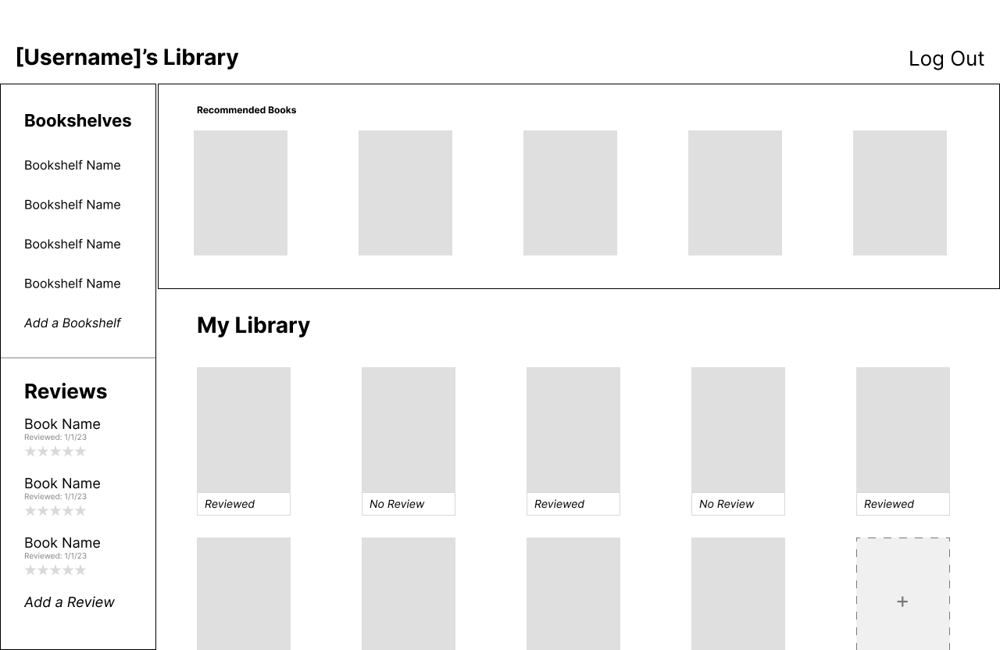

# Bookshelf/My Library  
### A Digital Bookshelf and Book Reviewer
My Library will allow the user to create Bookshelves, which are collections of Books. Books will be pulled in using data from the [Google Books API](https://developers.google.com/books/docs/overview). The user will also be able to review Books. A review contains a 1-5 star rating and a text review.

[Trello Board](https://trello.com/invite/b/H3GOBYxd/ATTIadca3da94bc344c05615cc151731b4c102FF4BC2/user-stories-books)

[Project 2 Requirements](https://git.generalassemb.ly/SEIR-Boston/project-2)

## Section 2: Screenshots:

### App Screenshots  

#### Login Page

#### Home Page

#### Edit Page

### Wireframes    

#### Wireframe of Landing Page

#### Wireframe of Home Page

#### Wireframe of Bookshelf Page

#### Wireframe of Book Details Page 

#### Wireframe of Review Details Page 

#### ERD Diagram

## Section 3: Technologies Used 

 - HTML
 - CSS
 - Javascript
 - Express
 - NodeJS
 - Green Sock (GSAP)
 - Google Books API
 - Mongoose
 - MongoDB

## Section 4: Getting Started  
myLibrary uses the Google Book API to search for books and add them to your digital library. Click on "Search" in the top nav in order to search for books. Add them to a bookshelf, and then view the bookshelf by clicking on it in the left-side nav.  
[Link to Project](https://mylibrary.fly.dev/)

## Section 5: Next Steps

Planned future enhancements (icebox items).
 - Copy books from one bookshelf to another
 - New and trending books on my homepage
 - Implement Book Reviews

